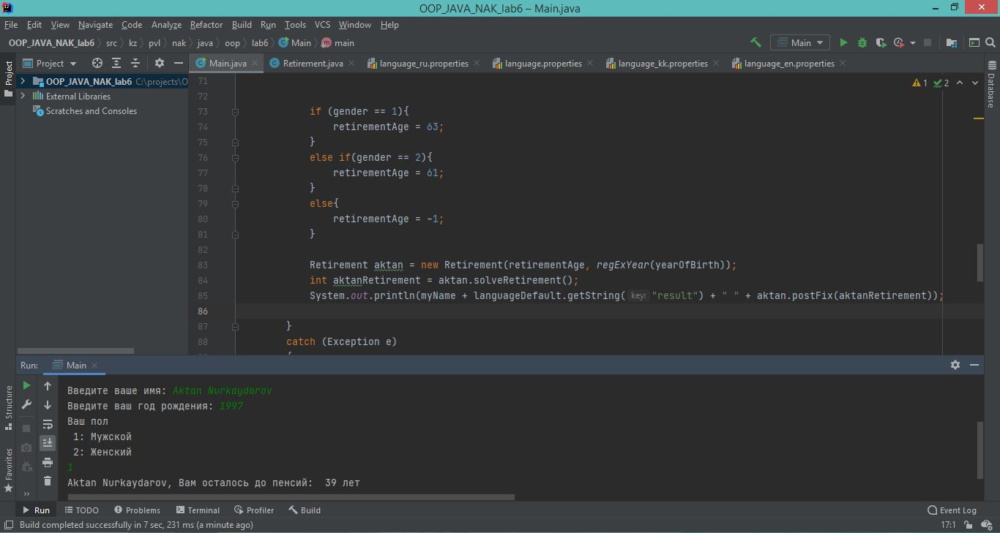
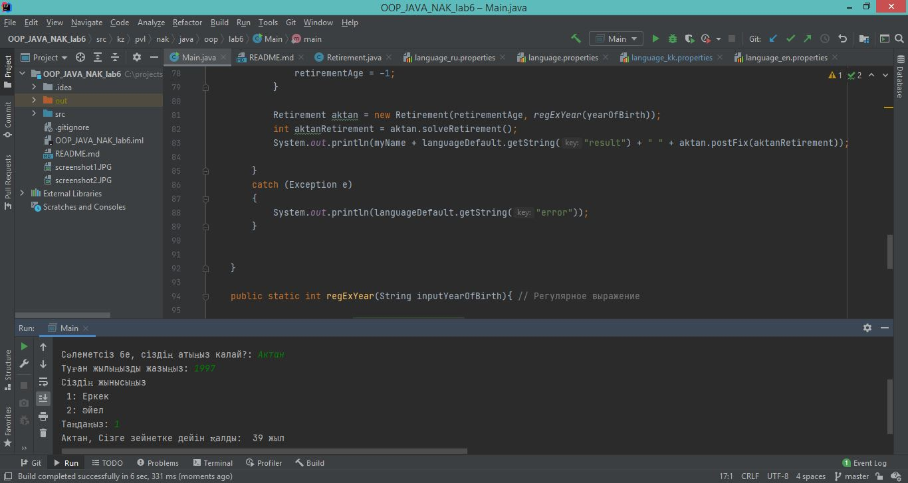

## Лабораторная работа №6 JAVA_OOP

---
__Задание:__ _Сделать консольную программу, взаимодействующуй с пользователем,
на дополнительном языке. В программе предумотреть 3 вопроса и 3 ответа для 
всех языков._

---

__Screenshots:__

_Скриншот 1: Результат на русском языке_

_Скриншот 2: Результат на казахском языке_
